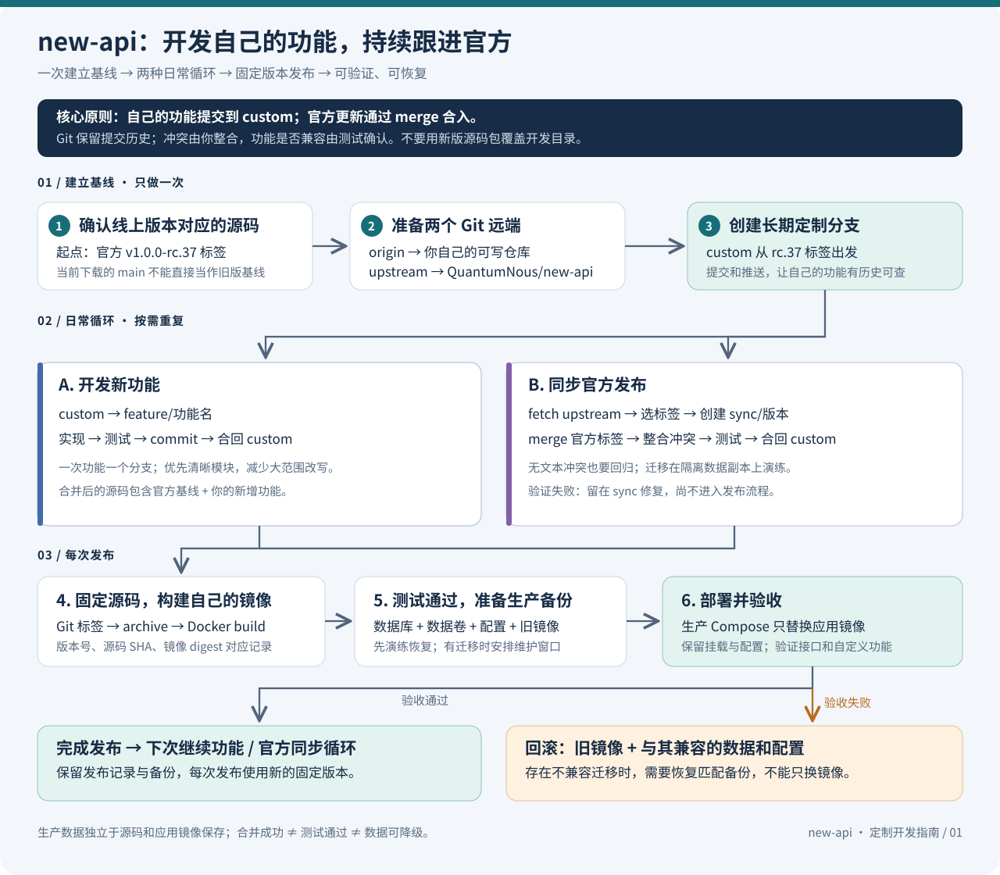
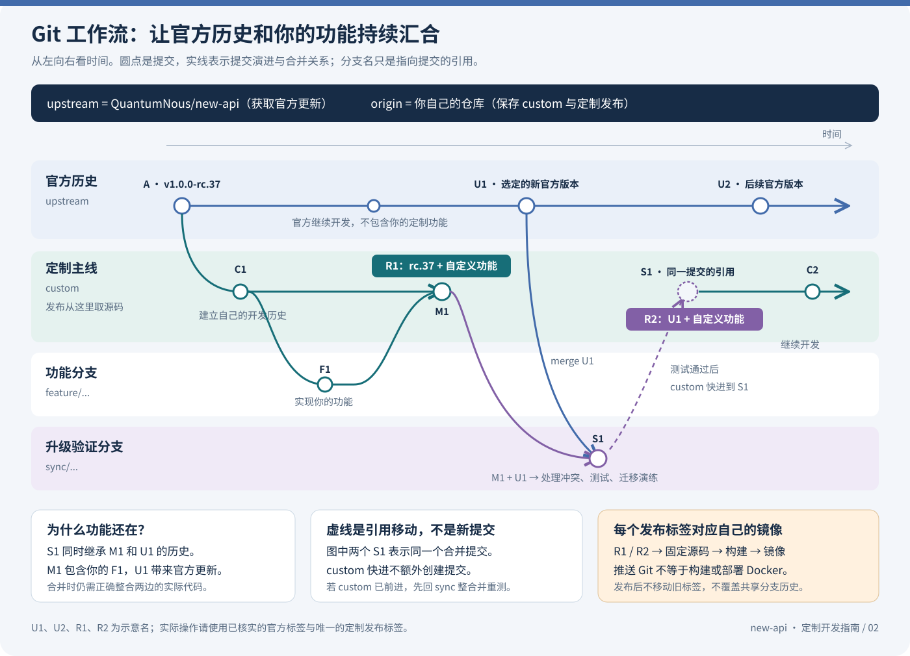

# new-api 二次开发、同步官方更新与 Docker 发布指南

适用场景：线上正在运行 `v1.0.0-rc.37`，准备开发自己的功能，并持续吸收 QuantumNous/new-api 的官方更新。

**推荐方案：自己的 Git 仓库 + 长期定制分支 `custom` + 功能分支 + 官方版本合并 + 自己的 Docker 镜像。** Git 能保留已提交的自定义改动；官方与自定义代码发生冲突时，需要人工整合。没有文本冲突也必须测试，不能承诺任意更新都自动兼容。

## 1. 先看两张图

### 完整操作流程



[单独打开操作流程 SVG](images/custom-operation-flow.svg)

### Git 分支与合并关系



[单独打开 Git 工作流 SVG](images/custom-git-workflow.svg)

图中的 `U1` 表示以后选定的官方版本，**不是实际 Git 标签名**；`C1`、`M1` 等是示意提交。

## 2. 你当前目录的实际情况

本次只检查本地仓库，没有查询远端发布列表或登录生产服务器：

| 项目 | 检查结果与含义 |
| --- | --- |
| 当前分支 | `main` |
| 当前提交 | `9c293e8c02371bda844af79e3500ff2d516d1dda` |
| 当前 origin | `https://github.com/leifengyang/new-api.git`；是否属于你、是否可写，需要按你的账号确认 |
| upstream | 当前未配置；官方仓库为 `https://github.com/QuantumNous/new-api.git` |
| 本地 `v1.0.0-rc.37` 标签 | 尚未找到，需要从官方获取并核对 |
| Git 历史 | 非浅克隆 |
| 当前 `VERSION` | 文件存在但内容为空；当前发布 CI 会在构建前写入版本号 |
| Docker 构建 | 根目录有多阶段 `Dockerfile`，会编译前端和 Go 后端 |
| Compose 示例 | 当前使用 `calciumion/new-api:latest`，不能直接代表你的生产配置 |

**下载到的 `main` 不等于你线上运行的 `v1.0.0-rc.37`。** 如果直接从现在的 `main` 开发，首次上线还会同时升级其间的官方改动。建议先从线上对应的官方标签开发；确认新功能后，再单独安排官方版本升级。

本指南选择重新克隆到一个独立开发目录，保留你当前目录。文中的 Git 命令是待执行示例；首次文档交付时未执行切分支、推送、构建或发布。后续规则维护使用独立的 `chore/custom-workflow-rules` 分支，见第 11 节，不代表已初始化业务开发基线。

## 3. 仓库、分支、标签和镜像分别做什么

| 名称 | 用途 | 日常规则 |
| --- | --- | --- |
| `upstream` | QuantumNous/new-api 官方远端 | 只获取官方更新 |
| `origin` | 你有写权限的 Fork 或自有仓库 | 备份自己的提交、分支与发布标签 |
| `custom` | 你的长期集成与发布分支 | 包含官方基线、定制功能和历次官方合并 |
| `feature/...` | 单个新功能 | 从 `custom` 创建，完成后合回 |
| `sync/...` | 一次官方升级的验证分支 | 从 `custom` 创建，合入指定官方标签，验证后合回 |
| `custom-v1.0.0-rc.37.1` | 第一次定制发布的 Git 标签 | 指向固定源码提交，发布后不移动、不复用 |
| `你的账号/new-api:custom-v1.0.0-rc.37.1` | 自己构建的 Docker 镜像 | 部署用固定标签，最好进一步固定 digest |

以后仍在 rc.37 上修补，可以发布 `.2`、`.3`；升级官方基线后，用新官方版本加定制序号命名。**Git 标签、镜像标签和容器中的应用版本应能相互对应。**

## 4. 第一次准备：以线上版本建立开发基线

以下开发与构建命令使用 **Windows PowerShell**。按小节逐条执行，任何一步报错都先处理，不要继续执行后续步骤。需要 Git、Docker Desktop（Linux 容器模式）；本地测试所需的 Go、Bun 版本以选定提交的文件为准。

### 4.1 准备自己的远端

在 GitHub 上 Fork 官方仓库。若现有 `leifengyang/new-api` 就是你的 Fork，可直接使用；否则使用你有写权限的仓库地址。先检查 Fork 内继承的 Actions：当前仓库的镜像工作流会响应标签推送，并引用官方镜像仓库，配置自己的镜像仓库与凭据前，应停用这些发布工作流。

在存放项目的父目录执行，修改第一行地址：

```powershell
$ForkUrl = 'https://github.com/YOUR_ACCOUNT/new-api.git'
git clone $ForkUrl new-api-custom
Set-Location new-api-custom
git remote add upstream https://github.com/QuantumNous/new-api.git
git fetch upstream --tags
git remote -v
git show --no-patch --format=fuller v1.0.0-rc.37
git switch -c custom v1.0.0-rc.37
git push -u origin custom
```

这里的 `git fetch` 只下载提交与引用，**不会把更新合进当前代码**。首次获取的官方标签应与[官方发布页](https://github.com/QuantumNous/new-api/releases)一致。若标签不存在，先查清线上镜像与官方源码提交的对应关系，不要用 `main` 猜测替代。如果已有同名但不同内容的标签，停止并查清来源，不要强制覆盖。

如果你选择直接使用原目录，应先提交或另行备份所有本地工作、确认 `origin` 的归属，再添加 `upstream` 并创建分支；原目录中未跟踪的配置、数据库不会因为 Git 分支而得到备份。本指南新增的文档也需要单独保存或提交。

### 4.2 功能开发循环

以“自定义报表”为分支名示例，文件名要换成实际修改的文件：

```powershell
git switch custom
git pull --ff-only origin custom
git switch -c feature/custom-report
# 编写功能、运行相关测试，然后只暂存本次需要的文件
git add path/to/changed-file
git diff --cached
git commit -m "feat: add custom report"
git push -u origin feature/custom-report
```

检查暂存内容不含 `.env`、数据库、密钥等运行数据。功能完整且测试通过后：

```powershell
git switch custom
git pull --ff-only origin custom
git merge --no-ff feature/custom-report -m "merge: custom report"
# 在合并后的 custom 再运行受影响的检查
git push origin custom
```

多人协作时，用目标分支为 `custom` 的 Pull Request 完成同样的合并。一次提交只表达一个目的；优先将扩展组织在清晰的模块里，减少不必要的全文件格式化、重命名和对官方核心代码的大范围改动，这会降低以后冲突的数量。

## 5. 官方更新后：在同步分支合并，不覆盖自己的代码

### 5.1 获取并选择一个真实发布版本

先阅读目标版本的官方 Release Notes、配置变更和迁移要求。以下用交互输入避免将尚未核实的版本号写成可执行命令：

```powershell
git switch custom
git pull --ff-only origin custom
git status --short
# 必须先处理未提交改动，使工作区干净
git fetch upstream --tags
git tag --list 'v*' --sort=-version:refname
$UpstreamTag = Read-Host '输入已经核实的官方版本标签'
git show --no-patch --format=fuller $UpstreamTag
git switch -c "sync/$UpstreamTag"
git merge --no-ff $UpstreamTag -m "merge: upstream $UpstreamTag"
```

优先合并明确发布标签。`upstream/main` 是持续变化的开发分支；采用它意味着接受尚未发布的改动。长期已经共享的 `custom` 推荐使用 `merge`，不反复 `rebase` 重写历史。

### 5.2 冲突怎么处理

Git 用双方共同祖先做三方合并：一般可以同时保留官方和你在不同位置的修改；同一段代码、删除与修改等情况会产生冲突。

```powershell
git status
git diff --name-only --diff-filter=U
```

打开列出的冲突文件，理解并整合两边逻辑，删除冲突标记。**本次合并的 ours 是含你功能的同步分支，theirs 是选定官方版本**；这不是“哪边总是正确”的判断。不要对全部文件直接选 ours/theirs，也不要把新版 ZIP 解压覆盖当前目录。

```powershell
git add path/to/resolved-file
# 对每个已处理的文件重复 git add
git diff --check
git diff --cached --check
git diff --name-only --diff-filter=U
# 上一条没有输出，且所有冲突已正确处理后
git merge --continue
```

如果暂时无法完成合并，在本次合并仍未结束时可以 `git merge --abort`，回到开始合并前的状态；这也是要求提前保持工作区干净的原因。

### 5.3 验证并合回 custom

没有冲突只表示文本可以合并，不代表接口、前端、数据库和你的业务行为兼容。至少验证原有核心流程、自定义功能和此次官方变更涉及的路径，并在独立测试环境演练升级。

当前下载的 `main` 有下面这些脚本；**rc.37 或其他标签可能不同，先检查该提交的 `web/package.json`、`go.mod`、Dockerfile 和 AGENTS.md**：

```powershell
Push-Location web
bun install --frozen-lockfile
bun run lint
bun run typecheck
bun run test
bun run build
Pop-Location
# 先构建 web/dist，再测试会嵌入该目录的 Go 主模块
go test ./...
```

逐条确认成功。对于存在 `relaykit/` 的版本，涉及该模块及其公共 API 时，还必须独立验证；下面保存并恢复原先的 `GOWORK`：

```powershell
$PreviousGoWork = $env:GOWORK
$env:GOWORK = 'off'
Push-Location relaykit
go build ./...
go test ./...
Pop-Location
$env:GOWORK = $PreviousGoWork
```

按所选版本的规则完成其他检查。如果自己的变更涉及数据库行为，按仓库规范在真实 SQLite、MySQL、PostgreSQL 上验证；迁移涉及新库、代表性旧库升级及重复启动，不能仅凭编译成功判断兼容。升级演练用生产备份的隔离副本，禁止测试服务连接生产数据库或生产 Redis。

```powershell
git push -u origin "sync/$UpstreamTag"
git switch custom
git pull --ff-only origin custom
git merge --ff-only "sync/$UpstreamTag"
git push origin custom
```

如果最后的 `--ff-only` 失败，通常是同步验证期间 `custom` 又有新提交：回到同步分支合并最新 `custom`、处理冲突、重新验证，然后再快进；不要强推。下一次官方更新重复本节即可，之前的定制提交仍保留在历史中。

## 6. 从固定源码构建自己的 Docker 镜像

### 6.1 固定这次发布的源码

下面以首次 rc.37 定制发布为例；若已升级，改成与实际基线对应的新名称。确认所有功能已提交、验证，工作区干净：

```powershell
git switch custom
git status --short
$Release = 'custom-v1.0.0-rc.37.1'
$ImageRepo = 'YOUR_DOCKERHUB_ACCOUNT/new-api'
git tag -a $Release -m "new-api custom release $Release"
git push origin custom
# 先按第 4 节检查或停用继承的标签发布工作流
git push origin $Release
```

`$ImageRepo` 必须换成自己的可推送仓库。这个流程使用本机 Docker 构建，不依赖 GitHub Actions。代码推送到 GitHub 不会自动变成你的 Docker 镜像。

### 6.2 用干净源码包构建，避免带入本地运行数据

当前目录存在被 Git 忽略的 `.env`、数据库和日志，而当前 `.dockerignore` 没有完整排除这些运行文件；`.gitignore` **不控制** Docker 构建上下文。使用固定标签的 `git archive`，只把 Git 已跟踪的源码交给 Docker。事先仍须确认历史中未误提交敏感数据。

以下在同一个 PowerShell 会话继续执行；为构建创建唯一临时目录，不改变开发目录的 `VERSION`：

```powershell
$SourceCommit = git rev-parse "$Release^{commit}"
$BuildDir = Join-Path ([System.IO.Path]::GetTempPath()) ("new-api-build-" + [guid]::NewGuid().ToString('N'))
New-Item -ItemType Directory -Path $BuildDir | Out-Null
$ArchivePath = Join-Path $BuildDir 'source.zip'
$SourceDir = Join-Path $BuildDir 'source'
git archive --format=zip --output=$ArchivePath $Release
Expand-Archive -LiteralPath $ArchivePath -DestinationPath $SourceDir
[System.IO.File]::WriteAllText((Join-Path $SourceDir 'VERSION'), $Release, [System.Text.UTF8Encoding]::new($false))
docker buildx version
docker buildx build --platform linux/amd64 --load --label "org.opencontainers.image.revision=$SourceCommit" --label "org.opencontainers.image.version=$Release" -t "${ImageRepo}:$Release" $SourceDir
```

`VERSION` 只在临时构建副本中写入，使应用显示定制版本；源码由 Git 标签定位。标签不可复用，镜像构建记录同时保留源码 SHA、平台和生成的镜像 digest。基础镜像、软件源等依赖也会影响产物，固定 Git 标签本身不保证每次构建字节完全相同。

上例适用于 x86_64 Linux 服务器。ARM 服务器改成 `linux/arm64`；跨架构构建需要 Docker 支持对应模拟环境或原生构建节点。采用**该标签自己的 Dockerfile**，不要把当前 main 的 Dockerfile 直接覆盖到 rc.37。当前 Dockerfile 会自动构建前后端，镜像构建成功并不替代业务测试。

### 6.3 推到自己的镜像仓库

```powershell
docker login
docker push "${ImageRepo}:$Release"
docker buildx imagetools inspect "${ImageRepo}:$Release"
```

记录输出中的 digest。需要同时发布 amd64 和 arm64 时，在已配置好多平台能力的 buildx builder 上使用 `--platform linux/amd64,linux/arm64 --push` 替代上面的单平台 `--load`，并保留同样的源码与版本标签参数。

不使用镜像仓库时，单平台构建后可运行 `docker save -o "new-api-$Release.tar" "${ImageRepo}:$Release"`，将 tar 传到服务器，运行 `docker load -i 对应文件.tar`。此方式后续不执行 `compose pull`，直接使用已导入的同名镜像。

## 7. 服务器部署：沿用生产数据，只替换应用镜像

以下是 **Linux 服务器 Bash** 示例，假定原来用 Docker Compose，应用服务名为 `new-api`。必须在现有生产 Compose 所在目录执行，并沿用原来的 `-p` 项目名、`-f` 文件及环境文件参数；若实际不同，所有命令相应调整。改变项目名可能让 Compose 创建全新的命名卷。

### 7.1 先准备可恢复的备份

记录当前应用镜像标签/digest、Compose 配置、环境文件、数据挂载、数据库版本和自定义发布标签，并保留旧镜像。备份主数据库、独立日志库（若有）和实际持久化文件，保留原先的密钥与连接配置。先验证备份确实能恢复。

- SQLite：停止所有会写入该库的进程后备份整个数据目录，或使用 SQLite 官方在线备份机制；运行中单独复制 `.db` 不一定得到一致备份。
- MySQL / PostgreSQL：使用对应版本支持的一致性备份或云数据库快照，同时覆盖独立日志库（若有）。不要在运行中简单复制数据库容器的数据目录作为通用备份方案。
- 有迁移或需要数据回退能力时，安排维护窗口、暂停写入，再取得最终一致备份。若上线后已产生新数据，恢复升级前备份会丢失这部分写入，需先保存并确定补偿方案。

不要运行 `docker compose down -v`，它会删除命名卷。不要把开发仓库中的示例 Compose 覆盖生产配置。

### 7.2 仅覆盖应用镜像

在现有生产目录新建 `compose.custom.yml`，替换账号与版本：

```yaml
services:
  new-api:
    image: YOUR_DOCKERHUB_ACCOUNT/new-api:custom-v1.0.0-rc.37.1
```

验证后也可写为 `YOUR_DOCKERHUB_ACCOUNT/new-api@sha256:实际digest` 以固定内容。私有镜像先在服务器 `docker login`。基础生产文件名假定为 `docker-compose.yml`：

```bash
docker compose -f docker-compose.yml -f compose.custom.yml config --images
docker compose -f docker-compose.yml -f compose.custom.yml pull new-api
# 备份完成、测试环境升级验证通过之后再执行
docker compose -f docker-compose.yml -f compose.custom.yml up -d --no-deps --no-build new-api
docker compose -f docker-compose.yml -f compose.custom.yml ps new-api
docker compose -f docker-compose.yml -f compose.custom.yml logs --tail=100 new-api
curl -fsS http://127.0.0.1:3000/api/status
```

按实际地址、端口检查状态响应中的成功标志。再实际验证管理界面、一次真实业务请求和你的自定义功能。`--no-deps` 让本次操作只重建应用服务，不主动升级数据库和 Redis；已有依赖应处于正常运行状态。保留现有卷、环境配置和必要密钥，同时补充目标版本明确要求的新配置。

单实例容器重建可能短暂中断请求；以上不是零停机发布方案。如果原来用 `docker run`，则记录旧容器的启动参数，在备份后用新镜像重建，沿用实际端口、卷、网络、环境和启动命令，不能直接照抄 Compose 命令。

### 7.3 失败时如何回滚

**代码回滚、镜像回滚和数据库回滚是三件事。**

1. 停止继续放量或暂停写入，保存错误日志与当前数据。
2. 如果确定没有不兼容的数据迁移，把覆盖文件中的镜像改回已记录的旧版本/digest，再执行同样的 `up -d --no-deps --no-build new-api` 并验证。
3. 如果存在不兼容迁移，先停止应用，按已演练的方案恢复匹配的数据库及持久化数据，再启动旧镜像。仅换回镜像不一定能恢复。
4. 源码修复从 `custom` 开新修复分支，重新测试并发布新标签。不要移动已经发布的标签或强制重置共享分支。

## 8. 以后每次工作的速查表

| 你想做什么 | 操作顺序 |
| --- | --- |
| 开发新功能 | `custom` → `feature/...` → 实现、测试、提交 → 合回 `custom` |
| 吸收官方更新 | `fetch upstream --tags` → 选定版本 → `sync/...` → `merge 官方标签` → 处理冲突、升级验证 → 合回 `custom` |
| 发布自己的版本 | 固定 Git 标签 → 干净源码包 → 写构建副本 VERSION → 构建、测试、推镜像 → 备份 → 替换生产镜像 |
| 回滚 | 旧镜像 + 与之兼容的配置和数据库；必要时恢复经过演练的备份 |

每次发布留存：官方基线标签、自己的发布标签、源码 SHA、镜像标签/digest、测试结果、备份位置与回滚步骤。备份和密钥应放在受控存储中，不提交到源码仓库。

## 9. 常见误解

- **“直接 git pull 就能更新官方并保留功能？”** `pull` 默认跟随当前分支绑定的远端；这里 `custom` 跟随 `origin/custom`。官方升级应明确 `fetch upstream`，再在同步分支合并选定官方标签。
- **“Git 提交在，功能就一定还在？”** 提交历史可以保留，但合并时选错内容、官方接口变化或后续修改都可能破坏功能，需要回归测试。
- **“拉取官方 Docker 镜像就包含我的功能？”** 官方镜像不含你的提交；必须构建并部署自己的镜像。
- **“Fork 网页上的 Sync fork 能完成发布？”** 它不替代定制分支的合并验证、冲突处理、镜像构建和生产部署。
- **“数据会随着重建镜像消失？”** 正确外置到卷或外部数据库的数据不在应用镜像中，但仍受卷配置、应用迁移和操作方式影响，因此必须备份与验证。
- **“应该修改官方项目标识吗？”** 保留 new-api、QuantumNous 的名称、版权、许可与归属信息；增加自己的功能和发布后缀即可。

## 10. 本文的验证范围

本次交付为操作说明及 SVG 图，依据当前本地 Git 状态、Dockerfile、Compose、构建脚本和工作流编写。没有执行官方标签拉取、源码合并、镜像构建、数据库验证或生产部署；`v1.0.0-rc.37` 的源码文件和实际升级要求，应在获取对应官方标签后再次核对。

## 11. 给开发助手的持久执行规则

本节由仓库根目录 `AGENTS.md` 引用，是此用户维护 new-api 定制版本的默认工作方式。后续会话应读取并执行，不依赖聊天历史。详细命令参照本文相应小节，并根据当前分支的工具链调整。

### 11.1 用户可以怎么说

| 用户指令 | 助手自动执行的范围 |
| --- | --- |
| `按定制流程开发：增加……功能` | 检查基线 → 功能分支 → 实现与测试 → 提交 → 合回 `custom` → 推送到已确认的自有远端 |
| `按定制流程修复：……问题` | 同样流程，使用 `fix/...` 分支，增加必要的回归验证 |
| `按定制流程同步官方：v实际版本` | 获取指定官方标签 → `sync/...` 合并 → 冲突整合与验证 → 合回并推送 `custom` |
| `按定制流程发布镜像：custom-实际发布版本` | 核实发布源码和验证结果 → 新发布标签 → 干净源码构建 → 推送到已确认的个人镜像仓库 → 报告 digest |
| `把这个版本部署到测试环境 / 生产环境` | 仅对明确指定并授权的目标执行部署；生产先准备可恢复备份和回滚方案 |

普通的“帮我开发……”“修复……”也默认采用本流程，不要求用户每次完整复述。用户明确说“只分析”“只改不提交”“不要推送”时，以这次更具体的限制为准。开发一个功能不会自动顺带升级官方版本、发布镜像或操作生产。

用户已要求自动处理流程内的 Git 操作。对当前任务需要的本地分支、提交、合并，以及目标已经确认的自有远端正常推送，不再逐步询问。环境权限提示仍须遵守；缺少会影响正确性的信息时只问那个缺失项，并继续能独立完成的工作。

### 11.2 每次开始前检查实际状态

1. 读取根目录及受影响目录的 `AGENTS.md`，按任务加载必要规则；读取本节，涉及具体操作时读取本文相应小节。
2. 检查 `git status`、当前分支、远端地址、分支跟踪关系、相关标签与提交历史；识别未完成合并/rebase。检查本次操作会触发的 Git hooks/CI，而非假定提交和推送完全没有附带效果。
3. 将用户已有改动和本任务改动区分开，不覆盖、不擅自丢弃或暂存其他工作；不要使用通用的 `git add .` 混入配置或数据。已有工作妨碍切分支时，优先使用合适的独立工作目录；不能安全隔离时说明具体阻碍。
4. `upstream` 应指向 `https://github.com/QuantumNous/new-api.git`；缺少时可添加并获取所需引用。已有 `upstream` 地址不同时先查明，不擅自替换。
5. `origin` 必须是用户已确认的自有仓库，或由已认证账号的仓库权限信息证实可写且归属符合用户意图。Git 配置中的姓名与 URL 字符串相似本身不是认证证据。目标不明时，先完成可做的本地工作，在推送前只询问一次仓库归属；确认后沿用，除非地址或权限变化。

最初记录：用户报告线上为 `v1.0.0-rc.37`；本地当时为 `main`，origin 为 `leifengyang/new-api`。这些是历史上下文，不能当作每次执行时的现状。上线版本只能通过实际部署核实；本地构建或创建标签不等于已上线。

### 11.3 首次初始化 custom

- 若 `custom` 已存在，检查其历史与已同步的官方标签，在该历史上继续；不要每次重新从 rc.37 创建。如果远端已有 `origin/custom`，先获取、核对并建立跟踪分支，避免另造一条同名历史。
- 只有确实尚无定制主线时，才从经核实的官方 `v1.0.0-rc.37` 标签创建 `custom`。使用前保留当前目录所有工作；不能核实标签与线上源码关系时，不用 `main` 顶替。
- 当前这套规则首次保存在 `chore/custom-workflow-rules` 分支。该分支基于下载时的 `main`，仅用于保全规则和文档。初始化后，仅移植这次规则提交所增加的 AGENTS 小节、操作文档和两张 SVG：检查目标版本原有规则后整合新增小节，避免覆盖旧版其他约定；检查提交范围后可 cherry-pick，并按此要求解决冲突。
- **不要 merge 整条 `chore/custom-workflow-rules` 分支来导入规则**，否则会同时把较新的 main 源码带入 rc.37。如果规则已更新，找到最新有效规则内容，仍仅移植规则相关变更。
- 规则移植后形成一次独立的准备提交，让以后克隆、切到 `custom` 或从它创建功能分支时都能读到指令。规则与文档维护可以使用 `chore/...` 分支；准备任务本身不代表业务主线已完成初始化。

### 11.4 默认功能与修复流程

1. 基于已核实的 `custom` 创建 `feature/<简短主题>` 或 `fix/<简短主题>`。如果正在继续同一任务的现有分支，就复用它；不要重复创建或混入别的功能。能够连接自有远端时先获取并快进更新 `custom`；出现分叉先查明差异，不强制重置。
2. 实现需求，遵循该版本代码约定、复用现有组件并运行必要检查。不要借开发机会自动合入 `upstream/main` 或最新官方版本。
3. 查看完整任务 diff，逐文件暂存，只提交本任务改动。检查通过后自动创建语义清楚的提交，不要求用户再说“帮我 commit”。Git 身份未配置时询问所需身份，不擅自修改配置。
4. 自动把完成功能合回 `custom`，优先保留 `--no-ff` 的功能合并记录；验证合并后的受影响行为。合并失败或检查失败时修复；存在必需且无法完成的验证时，不把该功能当作已验证成果合入 `custom`，保留任务分支并明确阻碍。
5. 目标自有远端已确认且权限允许时，自动普通推送任务分支和 `custom`，禁止强推。推送被拒绝时获取并整合合理的新增提交、重新验证再重试；分支保护要求 PR 时，遵循仓库 PR 规则创建合规 PR，不绕过保护。没有权限或远端目标未确认时，保留本地提交并准确报告未推送的原因。
6. 完成时简要报告分支、提交 SHA、验证结果，以及是否已合并、推送。不把“已写文件”说成“已提交”，不把本地成功说成远端成功。

### 11.5 同步官方与发布镜像

- 同步官方：明确目标版本后，按第 5 节执行 `fetch` → `sync/...` → `merge` → 冲突处理 → 回归和迁移演练 → 合回 `custom`。只说“同步官方”而没给版本时，可以查找并提出具体候选；发布通道或跨版本风险无法由上下文确定时，在合并前确认实际目标。
- 合并中保留自定义功能，也保留上游对 AGENTS.md 的规范更新。不得整份选择 ours/theirs 来省略规则整合，或丢失本节入口。
- 发布镜像：按第 6 节从已验证提交构建；使用个人仓库、唯一 Git 标签和镜像标签。推标签前检查继承的发布 CI，不向官方镜像命名空间发布，也不因标签触发意外部署。未知镜像仓库或凭据阻碍发布时，先完成可做的源码检查和本地构建，再处理缺失信息。
- 生产部署：只有用户明确要求或已有持续授权覆盖具体环境时才执行。已获授权不重复询问，但缺少必要备份、目标或访问权限时不得假装完成。按第 7 节保留生产配置、数据库和卷，报告验证及可恢复状态。

### 11.6 如何保留与迁移这份“记忆”

本规则是仓库中的版本化文件，不是保证在任意聊天或任意目录都存在的全局记忆。新会话应在含这些文件的仓库/分支内启动；仅重新下载官方源码不会包含你的规则。若切到尚未带入规则的旧分支，先按 11.3 移植；使用其他克隆时，应从自己的远端获取含规则的 `custom`。

Codex 会在启动时发现项目的 `AGENTS.md`；正在运行的其他会话应重新读取它或开启新会话。官方机制说明：[Custom instructions with AGENTS.md](https://developers.openai.com/codex/guides/agents-md)。
